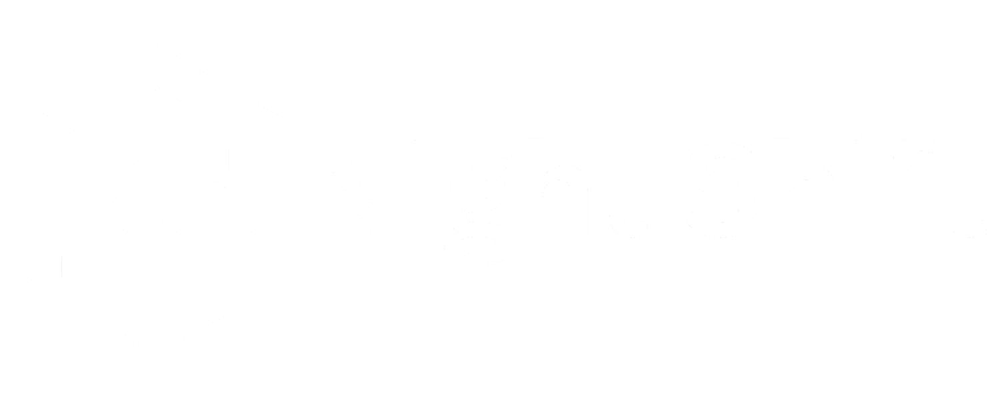

# 

**NightShift** is a modern coding practice platform designed to help developers **learn, practice, and improve their programming skills** through interactive problems and a clean, developer-focused interface.

The platform provides authentication, a problem library, a code editor, and a dashboard to track progress — all built with scalability and performance in mind.

---

## 🚀 Features

- 🔐 **Authentication system** (Login & Register)
- 📊 **User Dashboard** to access and manage activity
- 📚 **Problem List** with coding challenges
- 💻 **Integrated Code Editor** for solving problems
- 🎨 Clean, dark-themed UI optimized for developers
- ⚡ Designed for performance and scalability

---

## 🖼️ Screenshots

### 🔑 Login


### 📝 Register


### 📊 Dashboard


### 📚 Problem List


### 💻 Code Editor


---

## 🛠️ Tech Stack

**client**

- React
- Modern JavaScript (ES6+)
- Responsive UI

**Backend**

- Node.js
- Express.js
- RESTful APIs

**Database**

- MongoDB

**Other Concepts**

- Authentication & authorization
- API-driven architecture
- Scalable project structure

---

## 📂 Project Structure (High-Level)

```text
NightShift/
├── client/        # client (React)
├── server/        # Backend (Node.js / Express)
├── package.json   # Project dependencies
└── README.md
```
